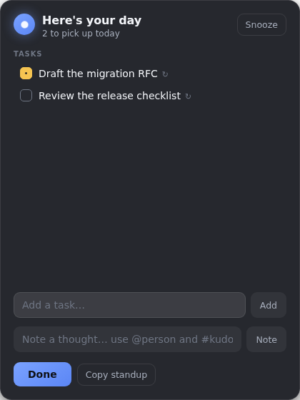

# Task Tracker

An ultra-lightweight Windows tray utility that asks, once an hour, what you're
working on — and writes the answers to a folder of plain Markdown you can hand to
an AI agent.

At **work start** it shows the day's list, seeded with whatever you didn't finish
yesterday. **Every hour** it slides in from the top-left to collect updates. At
**work end** it asks for the final update and next day's plan, then regenerates a
weekly rollup.

The point isn't the app. The point is that in December, "what did I actually ship
this year?" and "what has my report been up to?" have real answers.

## The vault

Everything lives in `Documents/TaskTracker` as one Markdown file per day:

```markdown
---
date: 2026-08-03
work_start: 09:00
work_end: 17:00
---

# Monday, 3 August 2026

## Tasks

- [ ] Draft the migration RFC
- [/] Ship the rollback path
- [x] Review the release checklist

## Notes

- 10:15 — @alice unblocked the release single-handedly #kudos
- 14:00 — Deferred the cache work until the RFC lands #decision
```

| Marker  | Meaning                          |
| ------- | -------------------------------- |
| `- [ ]` | Upcoming — planned, not started. |
| `- [/]` | In progress.                     |
| `- [x]` | Completed.                       |

Open tasks roll over to the next day (up to a 4-day gap, so a holiday doesn't
resurrect a stale list). Completed tasks stay in the day that finished them.

Notes take `@person` and `#tag` inline. `#kudos` is the one that earns its keep:
it's what makes a year of scattered observations into a review document.

### Reading it with an agent

The app writes a `CONTEXT.md` into the vault on every launch, documenting the
schema, the status markers, the tag conventions, and how to answer common
questions. Point Claude at the folder and ask:

- "What did I get done last week?"
- "What has @alice been working on this quarter?"
- "Help me draft my year-end review from these notes."

Hand edits are preserved — sections and frontmatter keys the app doesn't own
survive its writes untouched, so you and an agent can both write to a day file.



## Getting started

```bash
npm install          # deps + git hooks
npm run dev          # browser preview of the card — no Rust needed
npm run tauri dev    # the real desktop app (needs the Rust toolchain)
```

Settings live in `settings.json` in the app config directory:

| Setting           | Default   | What it does                                       |
| ----------------- | --------- | -------------------------------------------------- |
| `workStart`       | `09:00`   | When the day-start prompt fires.                   |
| `workEnd`         | `17:00`   | When the wrap-up prompt fires.                     |
| `vaultDir`        | (default) | Vault folder; empty means `Documents/TaskTracker`. |
| `hourlyEnabled`   | `true`    | Hourly nudges between start and end.               |
| `snoozeMinutes`   | `10`      | How long Esc / Snooze defers a check-in.           |
| `includeWeekends` | `false`   | Prompt on Saturday and Sunday too.                 |

> There is no settings UI yet — editing that file by hand is currently the only
> way to change your hours. It's the largest remaining gap before v0.1; see
> [`docs/future-work.md`](docs/future-work.md).

## How it interrupts you

A check-in is due when its **slot** is current and unhandled. Slots are derived
from your work window — one at work start, one on each hour, one at work end —
rather than from a repeating timer.

That distinction is the whole scheduler. Close your laptop at 11:55 and reopen it
at 15:30: a timer would owe you four prompts or none, while the current slot is
simply 15:00 and you get exactly one. Launching the app mid-afternoon is
immediately correct for the same reason.

Esc snoozes. "Done" marks the slot handled and gets out of the way until the next
hour.

## Tray menu

- **Status line** — today's done / open / notes counts.
- **Check in now** — open the card outside the schedule.
- **Copy standup summary** — yesterday's completed work, today's open items and
  any `#blocker` notes, on the clipboard and ready to paste.
- **Open vault folder**
- **Quit**

## Verifying it works

```bash
npm run check    # format, lint, typecheck, unit tests
npm run build    # it bundles
npm run e2e      # it actually runs — the real card, driven in a browser
```

The end-to-end suite drives the real check-in card: adding tasks, cycling
statuses, finishing a check-in and asserting the resulting Markdown. That's
possible because the frontend is framework-free and browser-runnable, so the
browser exercises the same controller, scheduler and serializer as the desktop
build.

`npm run e2e -- capture` regenerates `docs/screenshots/`. Look at them — a
screenshot has already caught a wrong prompt that no assertion did.

What e2e cannot cover: the tray, window positioning, transparency,
launch-at-login, and Windows focus behavior. Those need real hardware.

## Stack

Tauri v2, vanilla TypeScript, Vite. No UI framework, on purpose — the app runs
all day, so idle memory is a feature.

Pure logic lives in `src/lib` with sibling `*.test.ts` files. `npm run check`
runs format, lint, typecheck and tests; `npm run build` proves it bundles.

## Status

Pre-v0.1. The web layer is built and tested (258 unit tests plus 20 end-to-end
tests driving the real card in a browser), and the Rust layer compiles clean —
`cargo check`, `cargo test`, `cargo clippy -D warnings` and `cargo fmt --check`
all pass.

What has **never run** is the app itself on a Windows desktop. See "Known
unknowns" in [`docs/future-work.md`](docs/future-work.md) for what needs
verifying on real hardware, starting with whether the card can take keyboard
focus under Windows' foreground-activation rules — the one open question that
could force a design change.

The largest missing feature is a settings UI; work hours are currently only
editable by hand.

## License

MIT — see [LICENSE](LICENSE).
